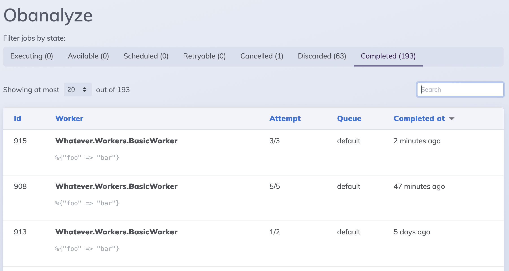
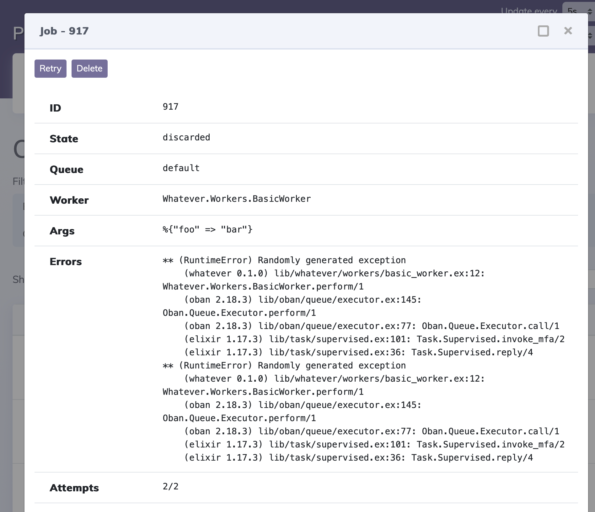

# Obanalyze

<!-- MDOC !-->

Obanalyze provides real-time monitoring for `Oban` within `Phoenix.LiveDashboard`,
delivering a user-friendly interface to manage background jobs seamlessly.

## Features

- **Job Management**: Retry, cancel, or delete jobs directly from the dashboard.
- **Filtering**: Filter jobs based on worker name or job arguments to quickly find what you're looking for.
- **Database Compatibility**: Fully compatible with SQLite, PostgreSQL or any database that Oban uses.

## Installation

The package can be installed by adding `obanalyze` to your list of dependencies in `mix.exs`:

```elixir
def deps do
  [
    {:obanalyze, "~> 1.3"}
  ]
end
```

## Configuration

Configure your application to include Obanalyze in `Phoenix.LiveDashboard`.
Update your router configuration as follows:

```elixir
# lib/my_app_web/router.ex
live_dashboard "/dashboard",
  additional_pages: [
    obanalyze: Obanalyze.dashboard()
  ],
  on_mount: [
    Obanalyze.hooks()
  ]
```

## Usage

After installation and setup, navigate to your `Phoenix.LiveDashboard` at the specified
route (e.g., `/dev/dashboard`). You will see the new `Obanalyze` tab, which provides
a complete overview of your background jobs.

## List view



## Single job view




# Alternatives

- [evilmarty/oban_live_dashboard](https://github.com/evilmarty/oban_live_dashboard): Inspired this project; a simplistic approach to Oban job monitoring.
- [Oban Web](https://getoban.pro): Official advanced dashboard offering extensive features, directly from the creators of Oban.
